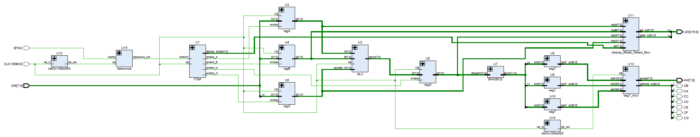

# ENEL373 - The ALU + FSM + REG project
Operand A is first entered, followed by operand B and lastly by OpCode. Switches used to enterd the operands and opcode. Center button used transition to the next state. OpCode operators are represented by: '00' means mathematical operator '+', '01' means mathematical operator '-', '10' means logical operator 'AND' and '11' means logical operator 'OR'. Switches represent binary values with most right switch being LSB and most left switch being MSB. OpCode operators are reserved to the first LSB bits and the last two MSB LEDs represent the FSM state that's being entered. The FSM has five states: Operand A, Operand B, Operand O, Operand G and reset. Operand A and B represent the integers, Operand O represnt the OpCode and Operand G represent the output. The seven-segment decoder outputs the state that has been entered after pressing the center button or transitioning to the next FSM state.
## Schematic

## Examples:
#### Example 1: Operand A = 16, Operand B = 8, Operand O = '+'

#### Example 2: Operand A = 16, Operand B = 8, Operand O = '-'

#### Example 3: Operand A = 16, Operand B = 8, Operand O = 'AND'

#### Example 4: Operand A = 16, Operand B = 8, Operand O = 'OR'

## Objectives of The Project
The objective of this project is to design an ALU component that can add, subtract, and perform bitwise AND or OR depending on the opcode/operation provided to the ALU.
The ALU should have two 8 bit operands anda a 2 bit opcode as inputs and should produce another 8 bit operand that will be saved into a register. 
The values saved into the input registers or the ALU input operands and the operation code are all supplied by the finite state machine. 
The fsm first state is the to take in the value of operand A and output it into register A is then fed into the ALU. 
The second state of the FSM is to save the operand B and output into register B. 
The FSM operand input values are entered using the switches of the Nexys 4 DDR Artix-7 FPGA board and the state is changed by pressing the central button.

## Inputs

#### FSM inputs
- buttonC
- clk

#### ALU inputs
- opreand A
- operand B
- opcode
- clk

#### RegisterA
- opreand A
- clk
- enable

#### RegisterB
- opreand B
- clk
- enable

#### RegisterG
- opreand G
- clk
- enable

#### RegisterO
- opreand O
- clk
- enable

#### BIN2BCD
- opreand G

#### seg7 - U7
- bcd(3 downto 0)

#### seg7 - U8
- bcd(7 downto 4)

#### seg7 - U9
- bcd(11 downto 8)

#### display_Mode_Select_Mux
- regA, regB, regG, regO
- sel
- clk

#### debounce
- button
- clk

#### clkDiv100to500
- clk_in

## Outputs

#### FSM output
- enable_A, enable_b, enable_C, enable_O 
- display_Mode

#### ALU output
- result

#### RegisterA
- opreand A

#### RegisterB
- opreand B

#### RegisterG
- opreand G

#### RegisterO
- opreand O

#### BIN2BCD
- BCD code

#### seg7 - U7
- bcd(3 downto 0)

#### seg7 - U8
- bcd(7 downto 4)

#### seg7 - U9
- bcd(11 downto 8)

#### display_Mode_Select_Mux
- led_out

#### debounce
- debounce_out

#### clkDiv100to500
- clk_out

## Buttons

#### Center
- Changes the state of the FSM and there are four states in total.

## Contributers
* [Hassan Alhujhoj](https://github.com/hassan-alhujhoj)
* [Abdullah Naeem]() 
* [Jin Kim](https://github.com/JsaKim)
